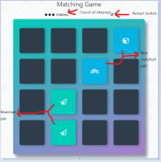
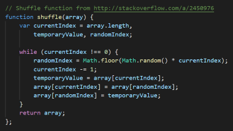

# Simple Matching Game

  

## Project Description

This project is the JavaScript project of the Udacity Front-end Nonodegree Program.   
The action of the game was produced using JavaScript.  
The design of the game used in this game uses the HTML and CSS code provided by Udacity.

## How to load the game

After downloading all the files and folders uploaded above, you can launch the game by running the index.html file.

## Parts of your game

The purpose of this game is to match all 16 cards in a total of eight pairs.  
Each time two cards are opened, the number of **"moves"** icons increases.   
This number shows your attempt to match cards.   
If a total of 16 cards match, the game ends.   
When you press the **"Restart"**  icon at the top, the game returns to its initial state.  

  

The card-shuffling function built into this game was provided by Udaity, and the original link to this code is as follows.  
http://stackoverflow.com/a/2450976  

## How to play  

1.	Download all files on this GitHub repository.
2.	Click the index.html file.
3.	Click the card with mouse left button.
4.	When the cards are matched, the colors of the open cards change to green
5.	If the cards don’t match, the open cards will pause for a while and then close again.
6.	Click and match cards until all cards are opened.
7.	When all the cards are paired up, the game is over with a message that shows “Congratulations”.
8.	Press Restart button if you want to do it again

  
  

